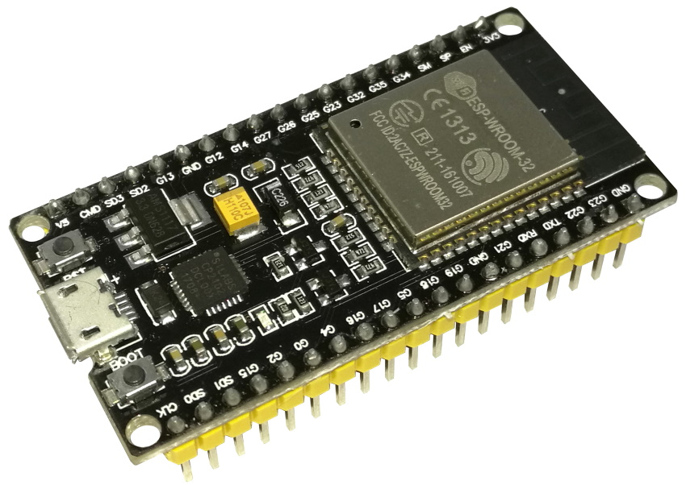
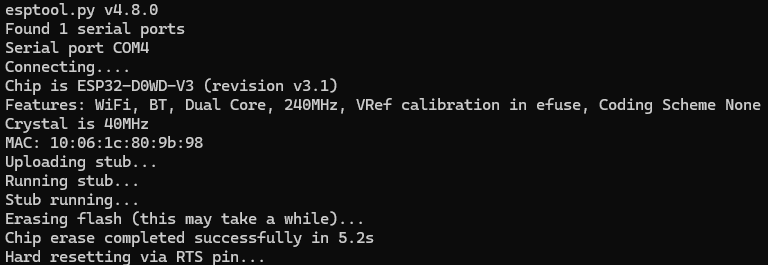
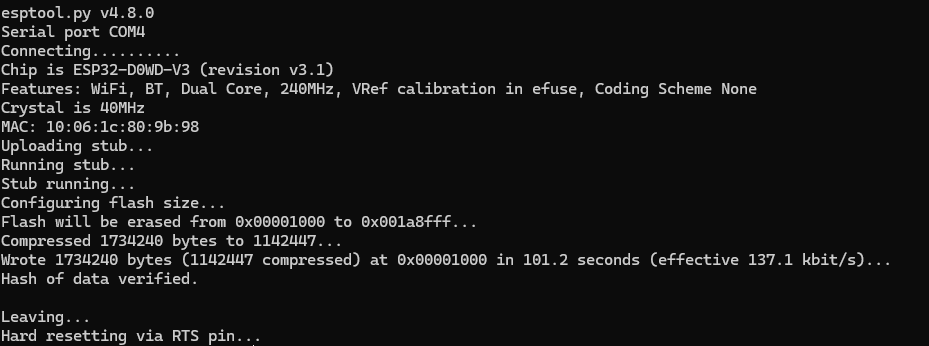

# ESP32
 Estudos e práticas relacionadas ao uso do ESP32 usando C++(ArduinoIDE) e MicroPy(VSCode)


**Importante**

Nota: depois de instalar o firmware MicroPython em seu ESP32 ou ESP8266, você pode voltar e usar o Arduino IDE novamente. Você só precisa fazer upload do código usando o Arduino IDE. Então, se você quiser usar o MicroPython novamente, precisará atualizar o firmware MicroPython.

## Instalação e configuração do firmware do ESP32.

O erro que você está vendo indica que o comando `pip` não está sendo reconhecido. Isso pode acontecer por alguns motivos, como o `pip` não estar instalado corretamente ou o caminho para o executável do `pip` não estar configurado no **PATH** do sistema.

Aqui estão os passos que você pode seguir para corrigir isso:

#### 1. Verifique se o `pip` está instalado
Se o `pip` não estiver instalado, você pode instalá-lo manualmente usando o Python:

- Abra um **Prompt de Comando**.
- Execute o seguinte comando para instalar o `pip`:

   ```bash
   python -m ensurepip --upgrade
   ```

Isso deve garantir que o `pip` seja instalado no seu sistema.

#### 2. Verifique se o `pip` está acessível
Mesmo que o `pip` esteja instalado, pode ser que ele não esteja no **PATH** do sistema, impedindo que você o execute de qualquer diretório. Para verificar isso, você pode usar o Python para chamar diretamente o `pip`:

- Tente usar o seguinte comando para chamar o `pip` através do Python:

   ```bash
   python -m pip install esptool
   ```

#### 3. Adicionar o `pip` ao **PATH** (caso necessário)
Se você descobrir que o `pip` está instalado, mas o comando `pip` ainda não está sendo reconhecido, você pode precisar adicionar o diretório do `pip` ao **PATH** do Windows. Aqui está como fazer isso:

1. **Descubra onde o `pip` está instalado**:
   - Abra um **Prompt de Comando** e digite:
   
     ```bash
     python -m site --user-site
     ```
   
   Isso mostrará o local onde o Python instala os pacotes. Normalmente, o `pip` está em uma pasta chamada `Scripts` dentro da pasta de instalação do Python. Anote esse caminho.

2. **Adicionar ao PATH**:
   - Clique com o botão direito no ícone do Windows (Iniciar) e selecione **Sistema**.
   - Clique em **Configurações avançadas do sistema** no lado esquerdo.
   - Na guia **Avançado**, clique em **Variáveis de Ambiente**.
   - Na seção **Variáveis de Sistema**, selecione **Path** e clique em **Editar**.
   - Clique em **Novo** e insira o caminho para o diretório onde o `pip` está instalado (geralmente algo como `C:\Users\<seu-usuário>\AppData\Local\Programs\Python\Python39\Scripts`).
   - Clique em **OK** para fechar as janelas e salvar as alterações.

3. **Reinicie o prompt de comando** e tente novamente o comando `pip`.

Com essas etapas, o `pip` deve funcionar corretamente, e você poderá instalar o `esptool` ou outros pacotes Python.

### Usando pip3

Sim, você pode usar `pip3` em vez de `pip`, especialmente se você estiver trabalhando com Python 3. O comando `pip3` garante que os pacotes sejam instalados na versão do Python 3, caso você tenha múltiplas versões de Python instaladas (por exemplo, Python 2 e Python 3).

Se o `pip3` estiver instalado e configurado corretamente no seu sistema, você pode rodar o seguinte comando:

```bash
pip3 install esptool
```

Se o `pip3` também não for reconhecido, você pode usar o Python diretamente para instalar pacotes com este comando:

```bash
python3 -m pip install esptool
```

Esse comando usa explicitamente o Python 3 para rodar o `pip`. Se você estiver no Windows e não tiver certeza sobre o caminho do Python, tente:

```bash
py -3 -m pip install esptool
```

Isso também irá garantir que a instalação ocorra na versão correta do Python (Python 3).

## Baixando e atualizando o firmware MicroPython no ESP32

Para baixar a versão mais recente do firmware MicroPython para o ESP32, vá para a página [Downloads do MicroPython](https://micropython.org/download/#esp32) e role até a seção [ESP32](https://micropython.org/download/ESP32_GENERIC/).

Faça o download do firmware que é um arquivo `.bin`. Escolha sempre o mais atualizados, não os que são versões preview builds.

Após o download da iso, verifique em qual pasta ela está localizada, possivelmente estará na pasta download. Vá com o seu terminal até a pasta e iremos fazer o reset da memória flash.

### Resetando a memória flash do ESP32.

Antes de atualizar o firmware MicroPython, você precisa apagar a memória flash ESP32. Portanto, com o ESP32 conectado ao computador, mantenha pressionado o botão "BOOT/FLASH" na placa ESP32

Nota: se sua placa não tiver um botão BOOT/FLASH, ela provavelmente entrará no modo intermitente automaticamente.

Enquanto mantém pressionado o botão "BOOT/FLASH", execute o seguinte comando para apagar a memória flash do ESP32

```python -m esptool --chip esp32 erase_flash```



*Não obrigatório:*
Quando o processo de "Apagamento" começar, você pode soltar o botão "BOOT/FLASH". Após alguns segundos, a memória flash do ESP32 será apagada.

### Instalando o firmware do Micropython no ESP32 com o esptool.py

Com sua memória flash ESP32 apagada, você pode finalmente atualizar o firmware MicroPython. Você precisa do nome da porta serial (COM7 no nosso caso) e do nome do arquivo .bin ESP32. Substitua o próximo comando por seus detalhes:

```python -m esptool --chip esp32 --port <serial_port> write_flash -z 0x1000 <esp32-X.bin>```


Sucesso!

Agora é só fazer a instalação do vscode, node, Pymark e usufluir do bom e do melhor desse mundo.


#### Fontes

[aranacorp](https://www.aranacorp.com/pt/programar-um-esp32-esp8266-com-micropython-e-vs-code/ )

[Random Nerd Tutorials](randomnerdtutorials.com)