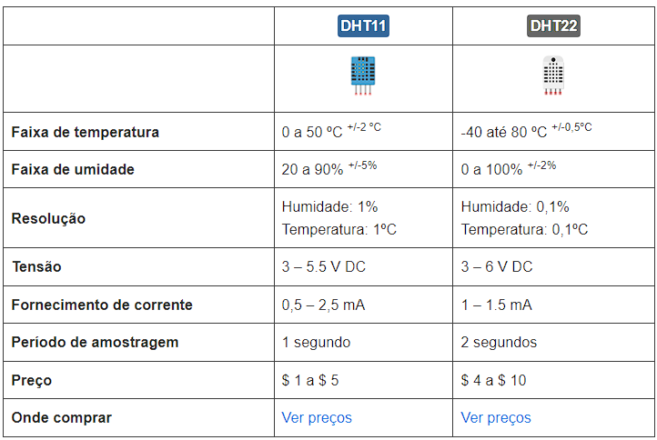

# MicroPython: ESP32 com sensor de temperatura e umidade DHT11*/DHT22

Este tutorial mostra como usar os sensores de temperatura e umidade DHT11* ou DHT22 com as placas de desenvolvimento ESP32, usando o firmware MicroPython. Essa pode ser a base que você terá e poderá usar para poder extrair essas informações de um ambiente e repassar para um gerenciador e posteriormente transformar em algum dashboard.

*Particulamente, eu tenho o DHT11 pois é bem barato e fácil de encontrar em qualquer loja de hardware.*

Os sensores DHT11 e DHT22 são usados para medir temperatura e umidade relativa. Estes são muito populares entre os fabricantes e amadores de eletrônicos. Esses sensores contêm um chip que faz a conversão analógica para digital e emite um sinal digital com a temperatura e a umidade. Isso os torna muito fáceis de usar com qualquer microcontrolador.

Apesar de suas diferenças, eles funcionam de maneira semelhante e você pode usar o mesmo código para ler temperatura e umidade. Você só precisa selecionar no código o tipo de sensor que está usando.

### Pinagem

Os sensores DHT têm quatro pinos, conforme mostrado na figura a seguir. No entanto, se você colocar seu sensor DHT em uma placa de fuga, ele virá com apenas três pinos e com um resistor pull-up interno no pino 2.

### Esquema de Montagem

Uso do módulo DHT
Há um dht módulo que vem com o firmware MicroPython por padrão. Portanto, é fácil obter temperatura e umidade.

1. Comece importando o dht e machine Módulos

import dht
from machine import Pin

